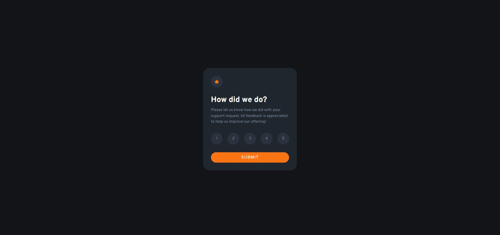
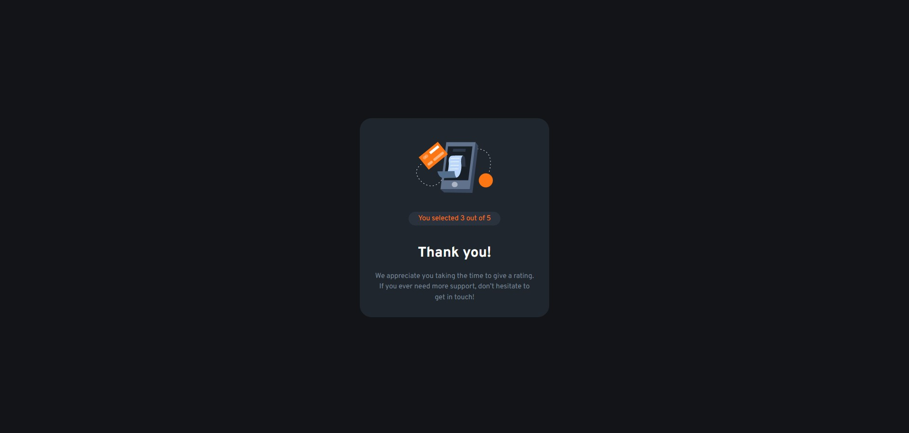

# Frontend Mentor - Interactive rating component solution

This is a solution to the [Interactive rating component challenge on Frontend Mentor](https://www.frontendmentor.io/challenges/interactive-rating-component-koxpeBUmI). Frontend Mentor challenges help you improve your coding skills by building realistic projects.

## Table of contents

- [Overview](#overview)
  - [The challenge](#the-challenge)
  - [Screenshot](#screenshot)
  - [Links](#links)
- [My process](#my-process)
  - [Built with](#built-with)
  - [What I learned](#what-i-learned)
- [Author](#author)

## Overview

### The challenge

Users should be able to:

- View the optimal layout for the app depending on their device's screen size
- See hover states for all interactive elements on the page
- Select and submit a number rating
- See the "Thank you" card state after submitting a rating

### Screenshot




### Links

- Solution URL: [https://github.com/DamonTham/Interactive-rating-component](https://github.com/DamonTham/Interactive-rating-component)
- Live Site URL: [https://damontham.github.io/Interactive-rating-component/](https://damontham.github.io/Interactive-rating-component/)

## My process

### Built with

- Semantic HTML5 markup
- CSS custom properties
- Flexbox
- JavaScript

### What I learned

```html
<div class="thankyou hide">
  
  <div class="thankyou-rating">
    <div>You selected <span class="selected-rating"></span> out of 5</div>
  </div>
  <h1 class="thankyou-heading">Thank you!</h1>
  <p class="thankyou-text">
    We appreciate you taking the time to give a rating. If you ever need more
    support, don’t hesitate to get in touch!
  </p>
</div>
```

```css
.rating-content {
  background-color: hsl(212, 19%, 15%);
  margin: 0 20px;
  padding: 30px;
  color: #fff;
  border-radius: 25px;
  display: flex;
  flex-direction: column;
}
```

```js
function ratingHandler(event) {
  ratingComponents.forEach((ratingComponent) => {
    ratingComponent.classList.remove("active");
  });

  event.target.classList.add("active");
  rating = event.target.innerText;
```

## Author

- Frontend Mentor - [@DamonTham](https://www.frontendmentor.io/profile/DamonTham)
